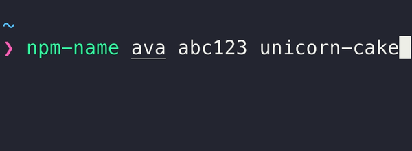

# `npm-name-checker`

> Check whether a package or organization name is available on npm



## Installation

```
$ npm install --global npm-name-checker
```

## Usage

```
$ npm-name --help

  Usage
    $ npm-name <name> …

  Examples
    $ npm-name chalk
    ✖ chalk is unavailable
    $ npm-name abc123
    ⚠ abc123 is squatted
    $ npm-name unicorn-cake
    ✔ unicorn-cake is available
    $ npm-name @ava
    ✖ @ava is unavailable
    $ npm-name @abc123
    ✔ @abc123 is available
    $ npm-name @sindresorhus/is unicorn-cake
    ✖ @sindresorhus/is is unavailable
    ✔ unicorn-cake is available

  Exits with code 0 when all names are available or 2 when any names are taken
```
